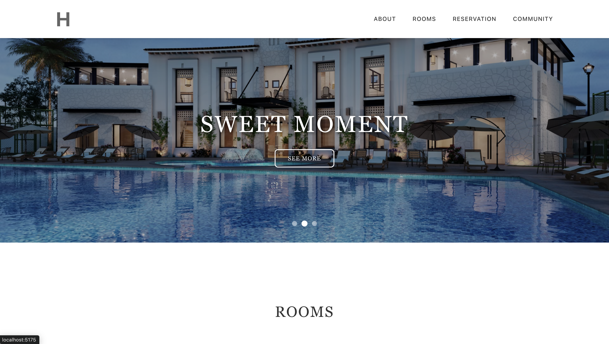
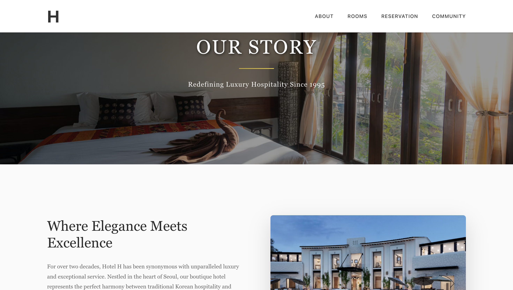
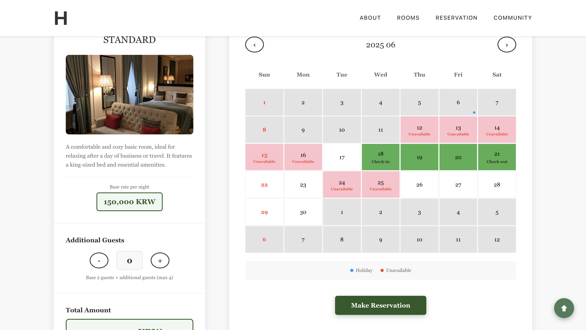
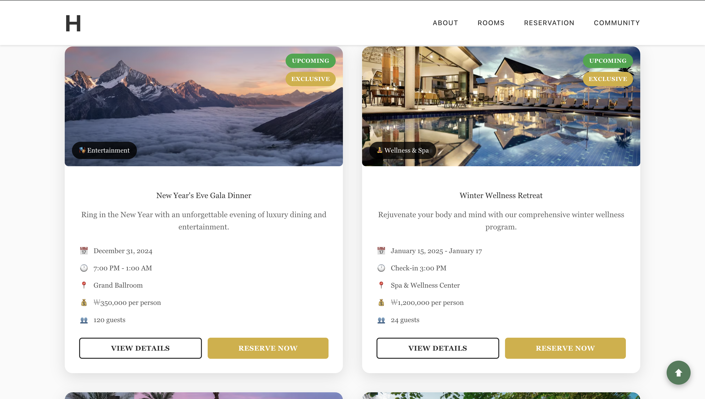

# Hotel Booking Site 🏨

A responsive hotel booking website built with React and Firebase, designed for global users to check availability, select dates, and reserve rooms in real-time.


🔗 Live Demo

## 🌐 https://hotel-booking-app-azure.vercel.app

## ✨ Features

- 🔥 Firebase Firestore integration for live booking updates
- 📅 Calendar-based check-in & check-out date selector
- 🛏️ Room type selection
- 🌍 Korean time zone (KST) support with UTC storage
- ⚠️ Booking restriction (e.g. max 6 days)
- ❌ Disable fully-booked or holiday dates
- 📱 Responsive Design
- 🔄 React state management with `useState` / `useEffect`

## 🚀 Tech Stack

- React with TypeScript
- JavaScript (ES6+)
- CSS
- Git & GitHub
- Firebase Firestore
- Vercel

## 📸 Screenshots







## 🛠️ Getting Started

```bash
git clone https://github.com/jinhyun-dev/hotel-site.git
cd hotel-project
npm install
npm run dev

## 📦 Deployment
Deployed on Vercel

## 🧑‍💻 Author
GitHub: @jinhyun-dev

